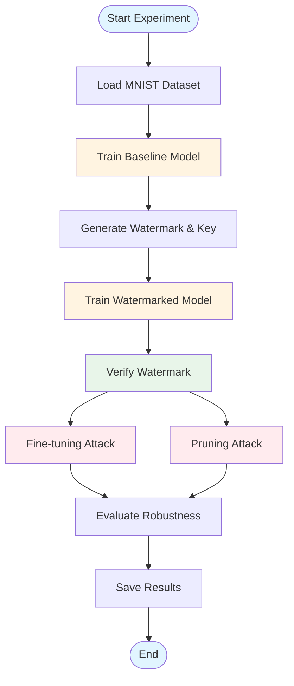
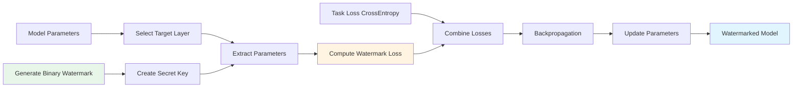
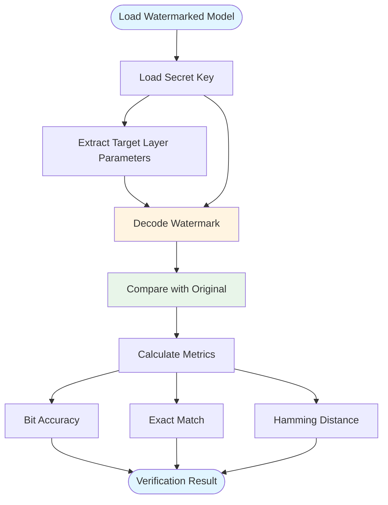
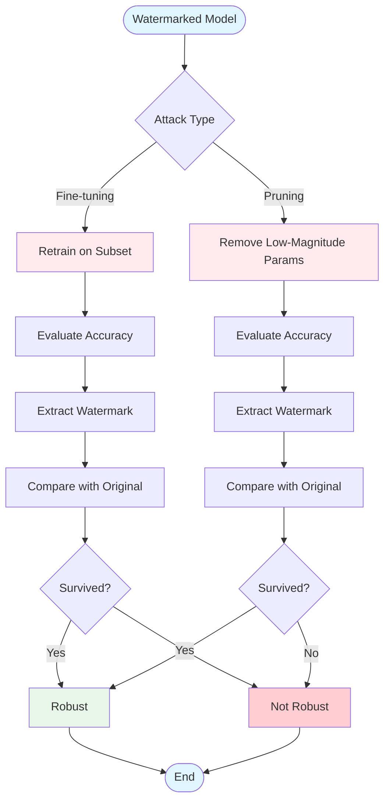
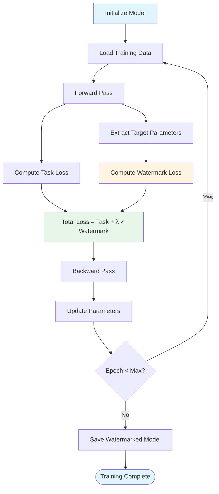
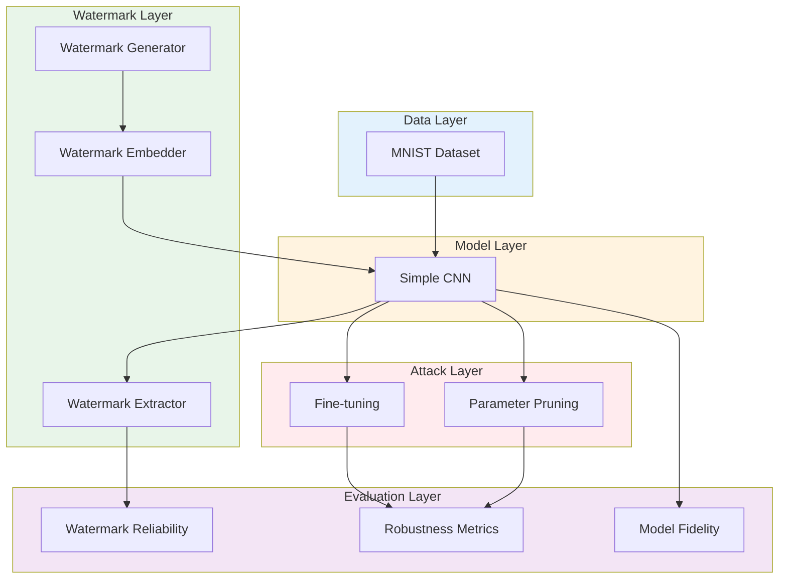

# Mermaid Charts for Program Flow

## Chart 1: Overall Experiment Pipeline

## Chart 2: Watermark Embedding Process

## Chart 3: Watermark Extraction and Verification

## Chart 4: Robustness Testing Flow

## Chart 5: Training Process with Watermark Embedding

## Chart 6: Complete System Architecture

